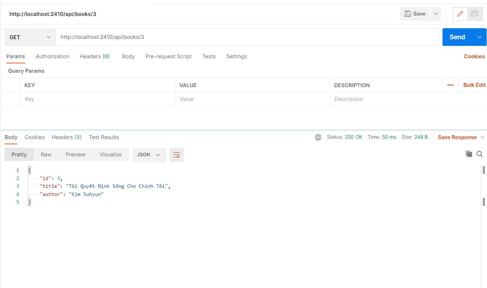
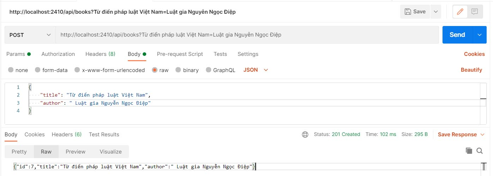
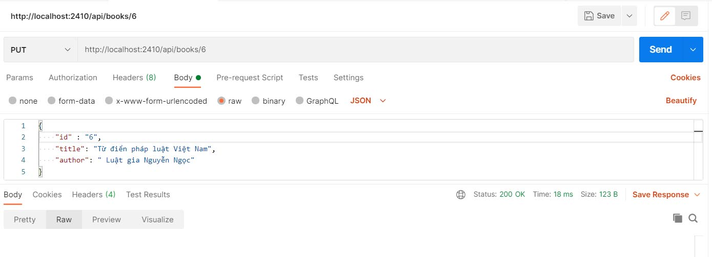
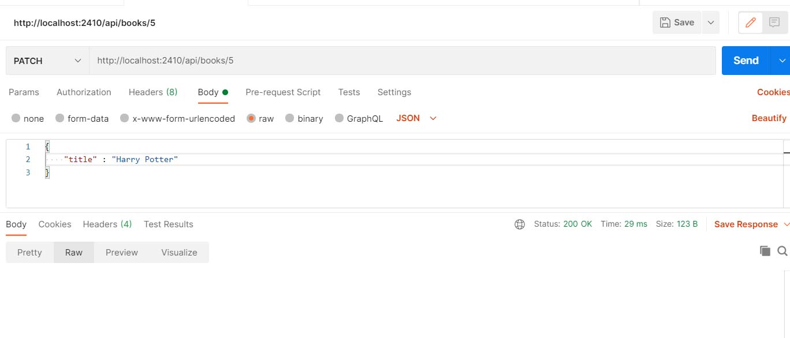
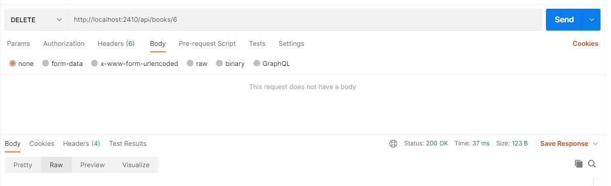

#Demo CRUD REST API

    demo book store
    pull code and run
    access http://localhost:2410/api
1. GET
    get all books: http://localhost:2410/api/books

2. GET BY ID
    get a book: http://localhost:2410/api/3

3. POST
    add book http://localhost:2410/api/boooks

4. PUT: update with all or any field
    update book: http://localhost:2410/api/books/6

5. PATCH: only update title field
    update title book: http://localhost:2410/api/books/5

6. DELETE
    delete book: http://localhost:2410/api/books/6
